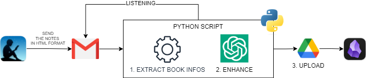

# KindleGPT - NotesEnhancer - For Obsidian
<p align="center">
  
</p>

## Problem Explanation

When I finish reading a book on my Kindle and want to create notes for that book in Obsidian, I'm typically required to send the notes from my Kindle to Readwise and then export them in markdown format to Obsidian. However, this script enables you to bypass the Readwise step.

This script actively monitors your Google Mail inbox, awaiting an email containing notes sent from the Kindle app. Subsequently, it cleans up the notes, submits them to ChatGPT for further enhancement (you have the freedom to choose the specific prompt to use with ChatGPT), stores them in a markdown file (and you can select from various templates), and uploads them to a Google Drive folder that is part of your Obsidian vault.

If you use Google Drive to synchronize your Obsidian vault, you'll have seamless access to your book notes on all your devices.

## Environment Configuration

Before using this project, you need to set up your development environment. Here's how:

1. **Python**: Ensure you have Python installed. This project is developed using Python 3.10 or higher.

2. **Clone the Repository**:

    ```bash
    git clone https://github.com/mingolladaniele/kindlegpt-notesenhancer.git
    cd kindlegpt-notesenhancer
    ```

3. **Create a Virtual Environment (Optional)**: It's a good practice to use a virtual environment to manage project dependencies. Create one and activate it using the following commands:

    ```bash
    python -m venv venv
    source venv/bin/activate   # On macOS and Linux
    venv\Scripts\activate      # On Windows
    ```

4. **Install Dependencies**: Install project dependencies:

    ```bash
    pip install -r requirements.txt
    ```

5. **Configuration**: In the `config.py` file, you should set two important values:
    - `OPENAI_API_KEY`: You can obtain an API key from OpenAI (more info here: [OpenAI API](https://openai.com/blog/openai-api)).
    - `OUTPUT_DIR_ID`: This is the ID of the folder on your Google Drive where your processed notes will be uploaded. *The Google Drive folder must be in the same Google account as the email being monitored by the script. To find the Folder ID, navigate to the folder in Google Drive and copy the ID found in the URL. It's everything that comes after "folder/". For example, if the URL was "https://drive.google.com/drive/folders/1234," then the Folder ID would be `1234`.
    - `SENDER_EMAIL`: Add the Google Mail address where you expect to receive the notes. This email will be used to alert you when your notes exceed the token threshold of ChatGPT.

6. **Set Up Google Workspace API**: Follow this tutorial to run the script and enable it to call a Google Workspace API: [Google API Quickstart](https://developers.google.com/gmail/api/quickstart/python). Be sure to place the `credentials.json` file in the `./auth` directory.

7. **Run the Project**: Execute the project using:

    ```bash
    python main.py
    ```

8. Send your notes from the Kindle app (here's a tutorial on how to do it: [How to Export Kindle Notes to Email](https://help.goodreads.com/s/article/How-can-I-export-my-Kindle-Notes-and-Highlights-to-my-email#:~:text=Open%20the%20book%20and%20tap,associated%20with%20your%20Amazon%20account)) to your Google Mail and enjoy.

## Personalization
- You can add your own prompts in txt format in `data/prompts`. Then change the `DEFAULT_PROMPT` reference in `config.py`.
- You can add your own templates in txt format in `assets/note_templates`. Then change the `DEFAULT_TEMPLATE` reference in `config.py`.
- You can change almost every path in the `config.py` file.

## Other Info
- All your processed notes will be saved in `data/files_to_upload`.
